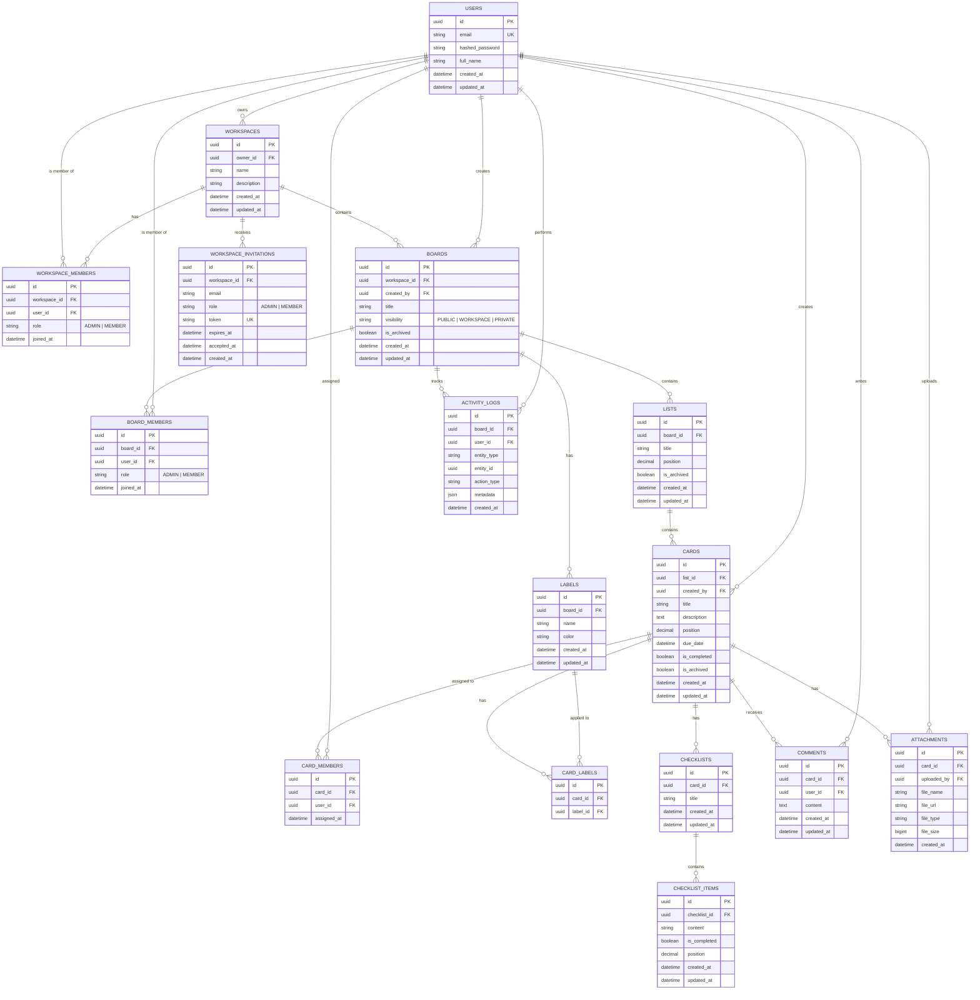

```mermaid
erDiagram

    USERS {
        uuid id PK
        string email UK
        string hashed_password
        string full_name
        datetime created_at
        datetime updated_at
    }

    WORKSPACES {
        uuid id PK
        uuid owner_id FK
        string name
        string description
        datetime created_at
        datetime updated_at
    }

    WORKSPACE_MEMBERS {
        uuid id PK
        uuid workspace_id FK
        uuid user_id FK
        string role "ADMIN | MEMBER"
        datetime joined_at
    }

    BOARDS {
        uuid id PK
        uuid workspace_id FK
        uuid created_by FK
        string title
        string visibility "PUBLIC | WORKSPACE | PRIVATE"
        boolean is_archived
        datetime created_at
        datetime updated_at
    }

    BOARD_MEMBERS {
        uuid id PK
        uuid board_id FK
        uuid user_id FK
        string role "ADMIN | MEMBER"
        datetime joined_at
    }

    LISTS {
        uuid id PK
        uuid board_id FK
        string title
        decimal position
        boolean is_archived
        datetime created_at
        datetime updated_at
    }

    CARDS {
        uuid id PK
        uuid list_id FK
        uuid created_by FK
        string title
        text description
        decimal position
        datetime due_date
        boolean is_completed
        boolean is_archived
        datetime created_at
        datetime updated_at
    }

    CARD_MEMBERS {
        uuid id PK
        uuid card_id FK
        uuid user_id FK
        datetime assigned_at
    }

    LABELS {
        uuid id PK
        uuid board_id FK
        string name
        string color
        datetime created_at
        datetime updated_at
    }

    CARD_LABELS {
        uuid id PK
        uuid card_id FK
        uuid label_id FK
    }

    CHECKLISTS {
        uuid id PK
        uuid card_id FK
        string title
        datetime created_at
        datetime updated_at
    }

    CHECKLIST_ITEMS {
        uuid id PK
        uuid checklist_id FK
        string content
        boolean is_completed
        decimal position
        datetime created_at
        datetime updated_at
    }

    COMMENTS {
        uuid id PK
        uuid card_id FK
        uuid user_id FK
        text content
        datetime created_at
        datetime updated_at
    }

    ATTACHMENTS {
        uuid id PK
        uuid card_id FK
        uuid uploaded_by FK
        string file_name
        string file_url
        string file_type
        bigint file_size
        datetime created_at
    }

    ACTIVITY_LOGS {
        uuid id PK
        uuid board_id FK
        uuid user_id FK
        string entity_type
        uuid entity_id
        string action_type
        json metadata
        datetime created_at
    }

    WORKSPACE_INVITATIONS {
        uuid id PK
        uuid workspace_id FK
        string email
        string role "ADMIN | MEMBER"
        string token UK
        datetime expires_at
        datetime accepted_at
        datetime created_at
    }


    USERS ||--o{ WORKSPACES : "owns"

    USERS ||--o{ WORKSPACE_MEMBERS : "is member of"
    WORKSPACES ||--o{ WORKSPACE_MEMBERS : "has"

    WORKSPACES ||--o{ BOARDS : "contains"
    USERS ||--o{ BOARDS : "creates"

    BOARDS ||--o{ BOARD_MEMBERS : "has"
    USERS ||--o{ BOARD_MEMBERS : "is member of"

    BOARDS ||--o{ LISTS : "contains"
    LISTS ||--o{ CARDS : "contains"

    USERS ||--o{ CARDS : "creates"

    CARDS ||--o{ CARD_MEMBERS : "assigned to"
    USERS ||--o{ CARD_MEMBERS : "assigned"

    BOARDS ||--o{ LABELS : "has"
    CARDS ||--o{ CARD_LABELS : "has"
    LABELS ||--o{ CARD_LABELS : "applied to"

    CARDS ||--o{ CHECKLISTS : "has"
    CHECKLISTS ||--o{ CHECKLIST_ITEMS : "contains"

    CARDS ||--o{ COMMENTS : "receives"
    USERS ||--o{ COMMENTS : "writes"

    CARDS ||--o{ ATTACHMENTS : "has"
    USERS ||--o{ ATTACHMENTS : "uploads"

    BOARDS ||--o{ ACTIVITY_LOGS : "tracks"
    USERS ||--o{ ACTIVITY_LOGS : "performs"

    WORKSPACES ||--o{ WORKSPACE_INVITATIONS : "receives"
```