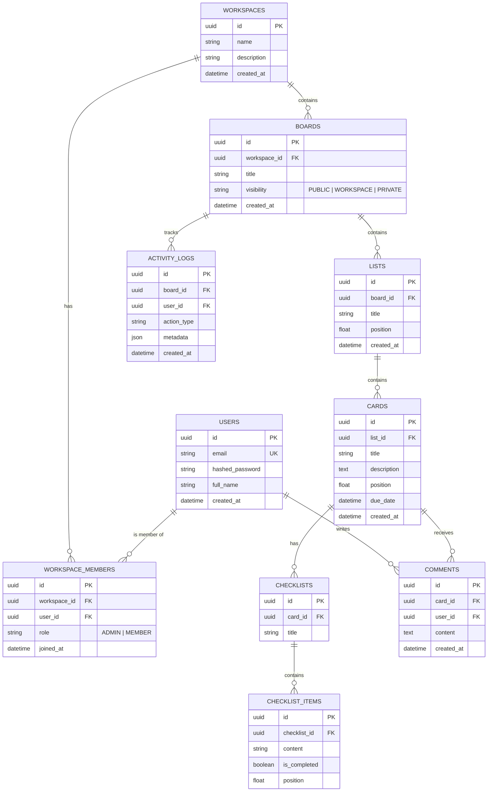

# Trello Backend Entity Relationship Diagram (ERD)

```mermaid
erDiagram
    USERS {
        uuid id PK
        string email UK
        string hashed_password
        string full_name
        datetime created_at
    }

    WORKSPACES {
        uuid id PK
        string name
        string description
        datetime created_at
    }

    WORKSPACE_MEMBERS {
        uuid id PK
        uuid workspace_id FK
        uuid user_id FK
        string role "ADMIN | MEMBER"
        datetime joined_at
    }

    BOARDS {
        uuid id PK
        uuid workspace_id FK
        string title
        string visibility "PUBLIC | WORKSPACE | PRIVATE"
        datetime created_at
    }

    LISTS {
        uuid id PK
        uuid board_id FK
        string title
        float position
        datetime created_at
    }

    CARDS {
        uuid id PK
        uuid list_id FK
        string title
        text description
        float position
        datetime due_date
        datetime created_at
    }

    CHECKLISTS {
        uuid id PK
        uuid card_id FK
        string title
    }

    CHECKLIST_ITEMS {
        uuid id PK
        uuid checklist_id FK
        string content
        boolean is_completed
        float position
    }

    COMMENTS {
        uuid id PK
        uuid card_id FK
        uuid user_id FK
        text content
        datetime created_at
    }

    ACTIVITY_LOGS {
        uuid id PK
        uuid board_id FK
        uuid user_id FK
        string action_type
        json metadata
        datetime created_at
    }

    USERS ||--o{ WORKSPACE_MEMBERS : "is member of"
    WORKSPACES ||--o{ WORKSPACE_MEMBERS : "has"
    WORKSPACES ||--o{ BOARDS : "contains"
    BOARDS ||--o{ LISTS : "contains"
    LISTS ||--o{ CARDS : "contains"
    CARDS ||--o{ CHECKLISTS : "has"
    CHECKLISTS ||--o{ CHECKLIST_ITEMS : "contains"
    CARDS ||--o{ COMMENTS : "receives"
    USERS ||--o{ COMMENTS : "writes"
    BOARDS ||--o{ ACTIVITY_LOGS : "tracks"
```