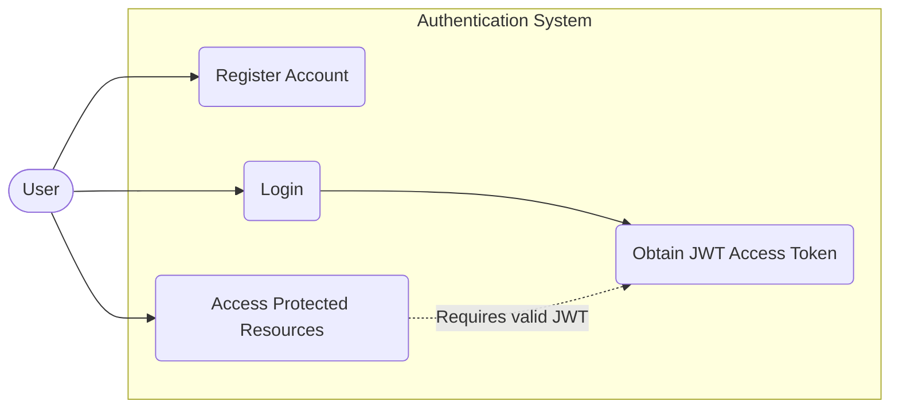
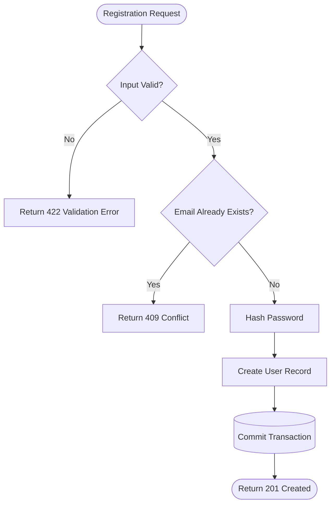
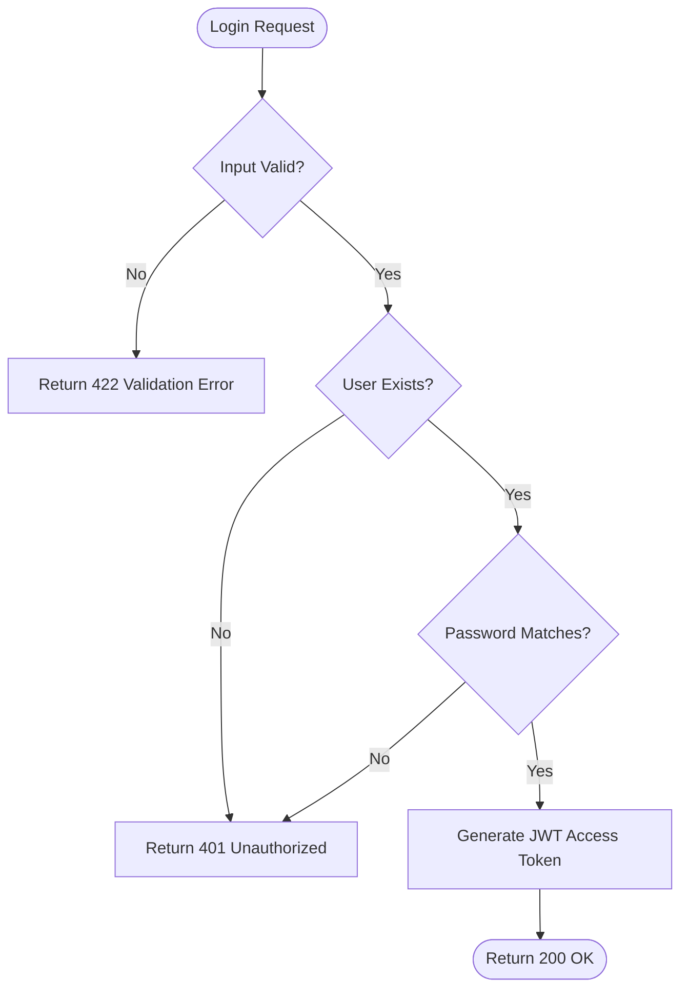
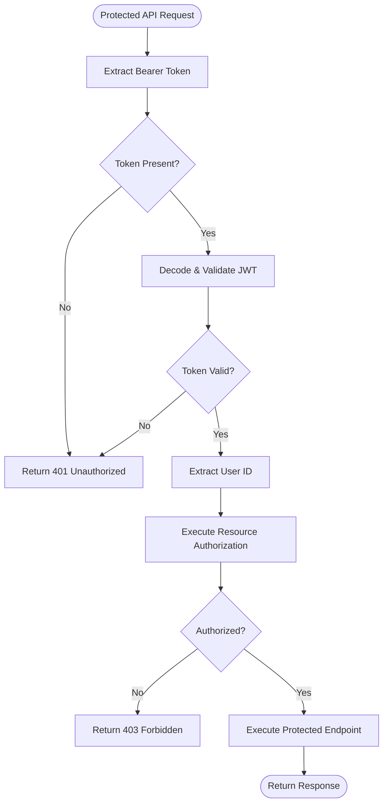
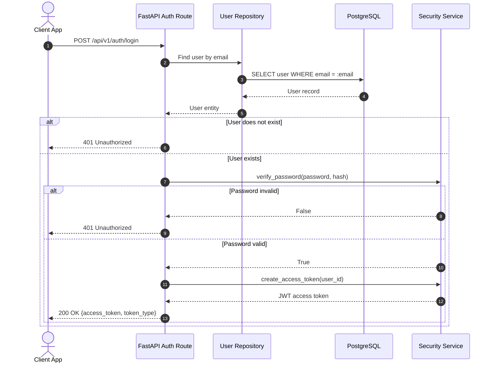
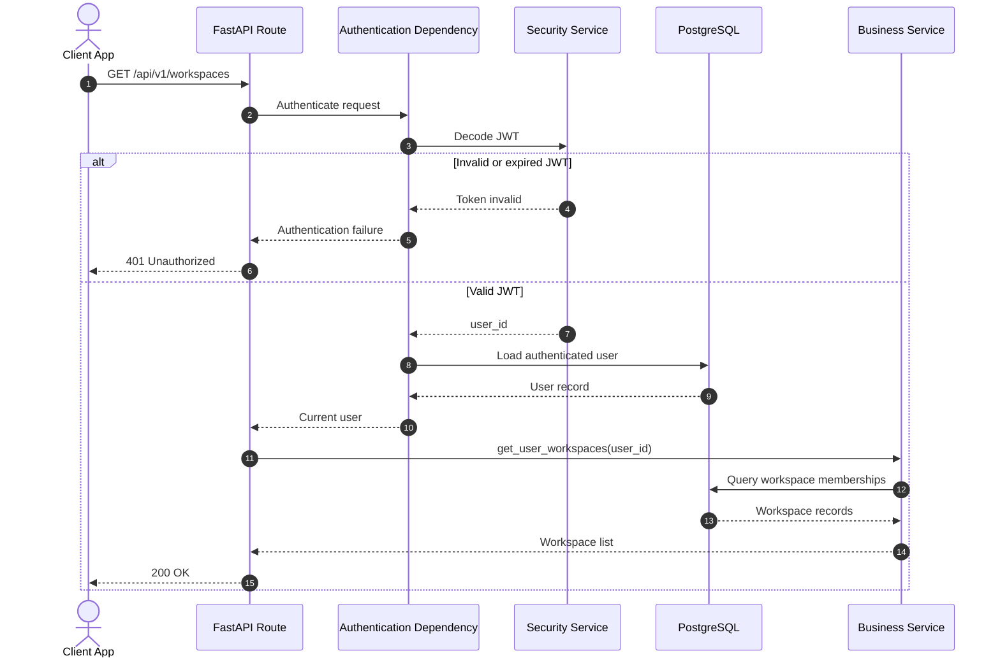

# Authentication & Identity Workflow

## 1. Overview
The authentication system allows users to:
* Register an account.
* Log in using email and password.
* Receive a JWT access token.
* Use the JWT to access protected API endpoints.

The backend is responsible for validating credentials, hashing passwords, generating tokens, and authenticating protected requests.

---

## 2. Use Case Diagram



| Use Case | Description |
| :--- | :--- |
| **Register Account** | Create a new user account. |
| **Login** | Authenticate using email and password. |
| **Obtain JWT Access Token** | Receive an access token after successful authentication. |
| **Access Protected Resources** | Use the JWT to access authenticated API endpoints. |

---

## 3. Registration Activity Diagram



### Registration Rules
* Email must be valid.
* Password must satisfy the configured password policy.
* Email must be unique.
* Password must never be stored in plaintext.
* The password is hashed before persistence.
* A successful registration returns **201 Created**.

---

## 4. Login Activity Diagram



### Login Rules
* The user is identified by email.
* The stored password hash is used for password verification.
* Invalid credentials return **401 Unauthorized**.
* The API should not reveal whether the email or password was incorrect.
* A successful login returns a JWT access token.

---

## 5. Protected Request Activity Diagram



---

## 6. Sequence Diagram — User Login



---

## 7. Sequence Diagram — Protected API Request



---

## 8. Authentication Error Rules

| Situation | Response |
| :--- | :--- |
| **Invalid request body** | `422 Unprocessable Entity` |
| **Email already exists** | `409 Conflict` |
| **Invalid credentials** | `401 Unauthorized` |
| **Missing JWT** | `401 Unauthorized` |
| **Invalid JWT** | `401 Unauthorized` |
| **Expired JWT** | `401 Unauthorized` |
| **Valid JWT but insufficient resource permission** | `403 Forbidden` |

---

## 9. Authentication Boundary

The authentication flow is divided into two distinct responsibilities:

```text
Authentication
    ↓
"Who are you?"
    ↓
JWT → User Identity

Authorization
    ↓
"What are you allowed to do?"
    ↓
RBAC / Resource Permissions
```

Authentication does not determine whether a user may modify a specific workspace, board, list, or card. That decision belongs to the authorization layer.