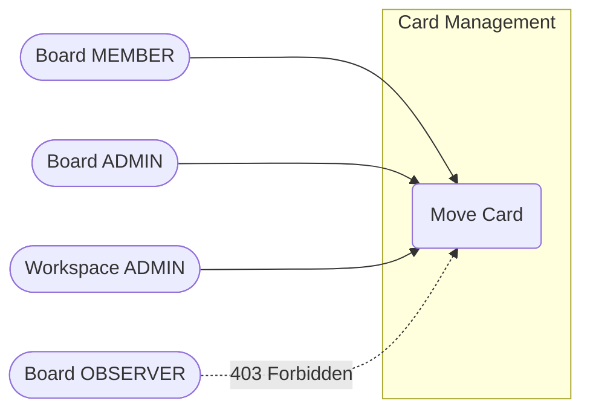
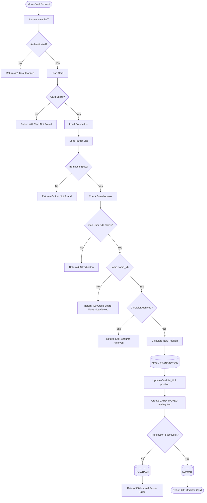
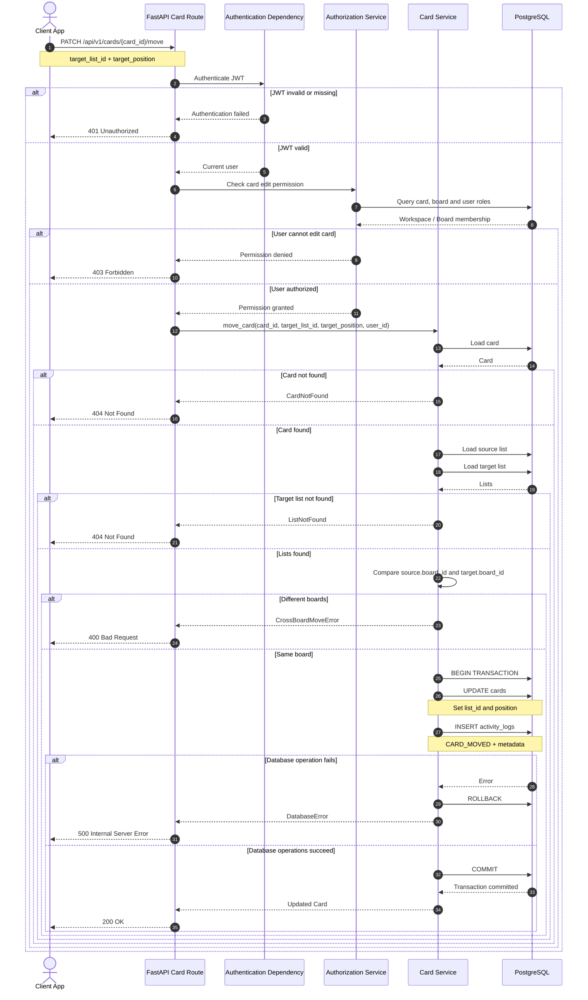

# Card Movement Workflow

## 1. Overview
A card can be moved from one list to another only when both lists belong to the same board. 
The operation changes:
* `cards.list_id`
* `cards.position`

and creates a corresponding activity log. The card update and activity-log insertion must occur inside the same database transaction.

---

## 2. Use Case Diagram



### Actors

| Actor | Can Move Card? |
| :--- | :--- |
| **Workspace ADMIN** | Yes |
| **Board ADMIN** | Yes |
| **Board MEMBER** | Yes |
| **Board OBSERVER** | No |
| **Non-member** | No |

---

## 3. Activity Diagram



---

## 4. Card Movement Business Rules

* **Rule 1 — Authentication:** The request must contain a valid JWT. Missing or invalid JWT returns `401 Unauthorized`.
* **Rule 2 — Card Existence:** The requested card must exist. Missing card returns `404 Not Found`.
* **Rule 3 — Target List Existence:** The target list must exist. Missing target list returns `404 Not Found`.
* **Rule 4 — Authorization:** The user must have card-editing authority:
  * **Allowed:** `Workspace ADMIN`, `Board ADMIN`, `Board MEMBER`
  * **Denied:** `Board OBSERVER`, `Non-member`, `Unauthenticated user`
* **Rule 5 — Same-Board Restriction:** The source list and target list must belong to the exact same board:
  $$\text{source\_list.board\_id} == \text{target\_list.board\_id}$$
  Moving cards across different boards returns `400 Bad Request`.
* **Rule 6 — Archived Resources:** An archived card or an archived target list cannot participate in a normal move operation. Attempting to do so returns `400 Bad Request`.
* **Rule 7 — Position:** The new position determines the card's ordering within the target list. For example, moving a card between Card A ($1000$) and Card B ($2000$) sets the new position to:
  $$\text{new\_position} = \frac{1000 + 2000}{2} = 1500$$
* **Rule 8 — Atomicity:** `UPDATE cards` and `INSERT activity_logs` must succeed or fail together inside a single database transaction. If either operation fails, a complete `ROLLBACK` is executed.

---

## 5. Sequence Diagram — Card Movement



---

## 6. Activity Log Metadata

A successful card movement generates an activity log with the board context indexed directly:

```json
{
    "entity_type": "CARD",
    "entity_id": "card-uuid",
    "action_type": "CARD_MOVED",
    "metadata": {
        "source_list_id": "source-list-uuid",
        "target_list_id": "target-list-uuid",
        "old_position": 1000.0,
        "new_position": 1500.0
    }
}
```

The `board_id` is stored on the root activity record to ensure querying board activity feeds remains performant without expensive multi-table joins.

---

## 7. Position Calculation

While the client may calculate a target position based on adjacent elements, the backend verifies and calculates the final decimal offset:

* **Move between two cards:**
  $$\text{new\_position} = \frac{\text{previous\_position} + \text{next\_position}}{2}$$
  *Example:* $\frac{1000 + 2000}{2} = 1500$

* **Move to the beginning of a list:**
  $$\text{new\_position} = \frac{\text{next\_position}}{2}$$
  *Example:* $\frac{1000}{2} = 500$

* **Move to the end of a list:**
  $$\text{new\_position} = \text{previous\_position} + 1000$$
  *Example:* $3000 + 1000 = 4000$

---

## 8. Position Rebalancing

Frequent drag-and-drop actions between neighboring cards cause the floating-point gap to shrink progressively:

$$1000.0 \rightarrow 1000.000001 \rightarrow 1000.0000005$$

When the difference $|\text{next} - \text{prev}| \le 0.000001$, a list rebalance triggers. The list's cards are queried by `position ASC` and reassigned clean thousand-step increments ($1000, 2000, 3000, 4000, \dots$) within an atomic transaction.

---

## 9. Error Matrix

| Condition | HTTP Status |
| :--- | :--- |
| Missing JWT | `401 Unauthorized` |
| Invalid JWT | `401 Unauthorized` |
| Card does not exist | `404 Not Found` |
| Target list does not exist | `404 Not Found` |
| User lacks card-edit permission | `403 Forbidden` |
| Card or target list archived | `400 Bad Request` |
| Lists belong to different boards | `400 Bad Request` |
| Invalid target position | `422 Unprocessable Entity` |
| Database transaction failure | `500 Internal Server Error` |
| Successful card movement | `200 OK` |

---

## 10. Transaction Boundary

The database operations follow strict ACID guarantees:

**Commit Flow:**
```text
BEGIN
   │
   ├── UPDATE cards (list_id, position)
   │
   ├── INSERT activity_logs (CARD_MOVED, metadata)
   │
   └── COMMIT
```

**Rollback Flow:**
```text
BEGIN
   │
   ├── UPDATE cards
   │
   ├── INSERT activity_logs  (Fails)
   │
   └── ROLLBACK
```

No partial updates are persisted if logging or updates encounter an error.